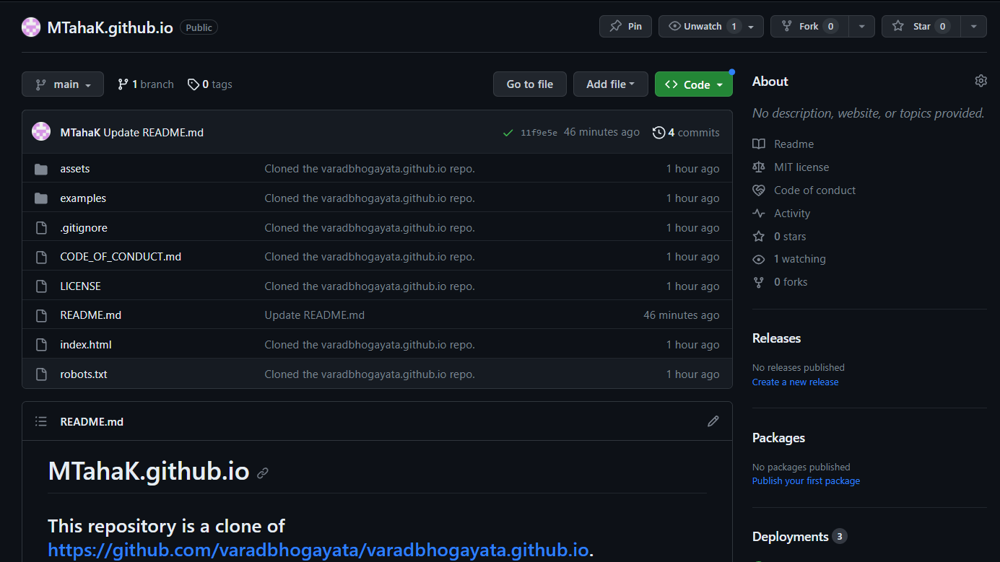
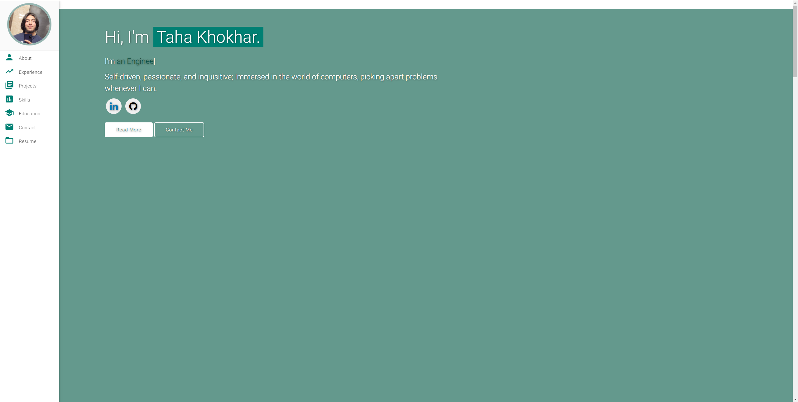
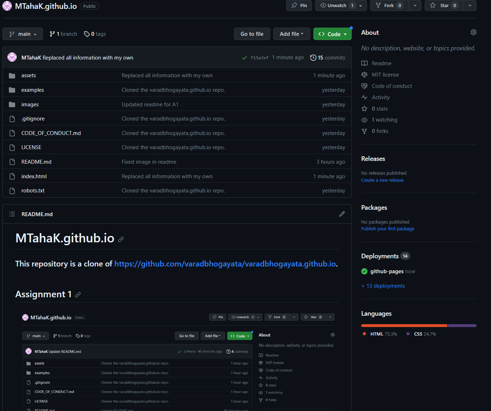
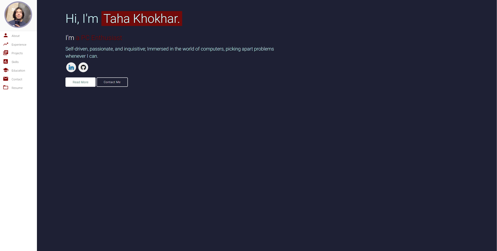
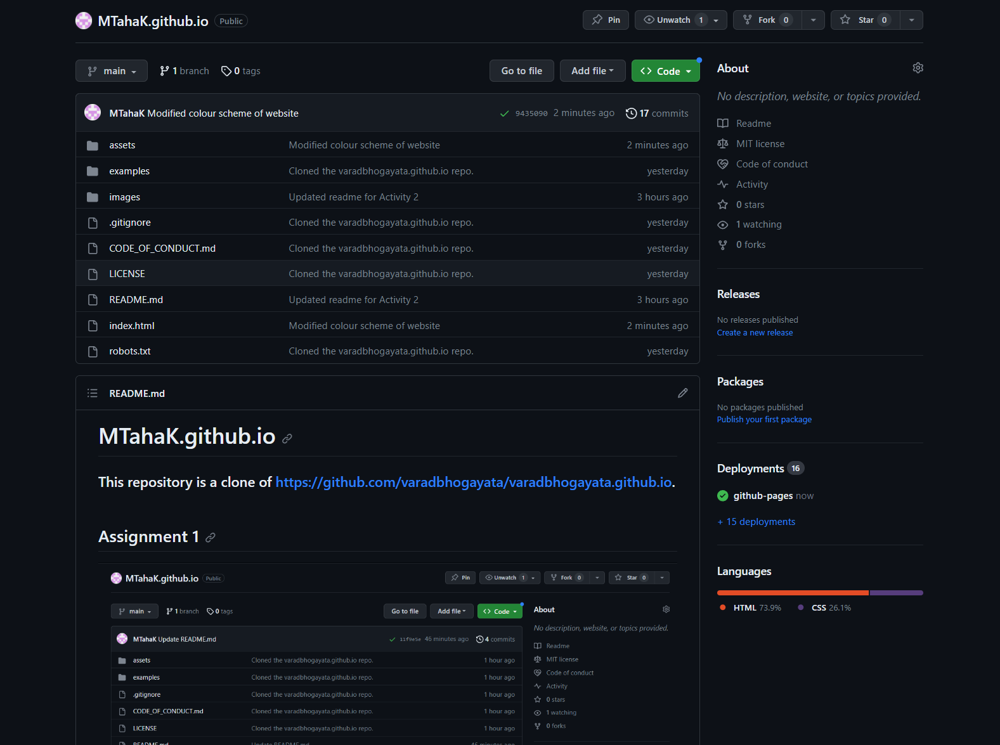
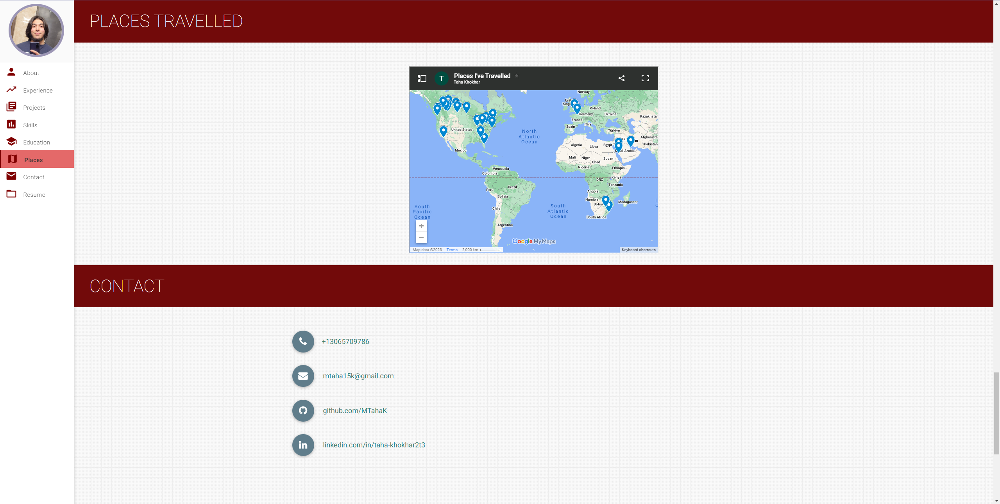
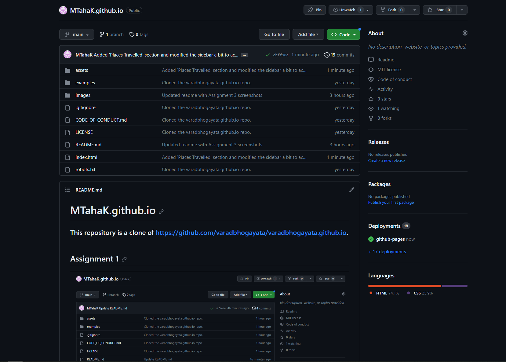

# MTahaK.github.io
### This repository is a clone of https://github.com/varadbhogayata/varadbhogayata.github.io.
## You can find this website deployed at mtahak.github.io
## Assignment 1

## Assignment 2

## Assignment 3

## Assignment 4

